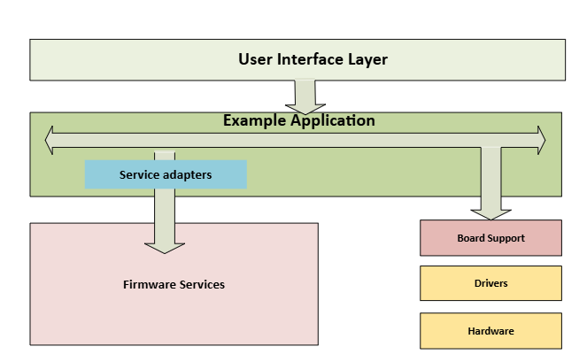


<p align="center">
    <br>
</p>

# Energy Firmware Services

- [Introduction](#introduction)
- [Directory Structure](#directory-structure)
- [Expected Use Case Model](#expected-use-case-model)
- [Tools Required](#tools-required)
- [API Documentation](#api-documentation)
- [License](#license)
- [Contributing](#contributing)
- [Contact](#contact)

## Introduction

**Energy Firmware Services** is a collection of software modules frequently used in energy firmware development. These modules are written as hardware-agnostic with dependency injection 

## Directory Structure

```
├──services
├── <service_name>                # Individual service directory
│   ├── source                    # Service source files
│   ├── include                   # Service header files
│   └── CMakeLists.txt            # CMake build configuration for the service
├── docs                          # API documentation, diagrams, and related resources
```

## Expected Use Case Model

These firmware services are designed as hardware-agnostic modules aligning with the ADI Energy Firmware Architecture. Each service communicates with hardware peripherals through the APIs injected by the application. The service API defines the `ADI_XX_CONFIG` structure and appropriate `ADI_XX_YY_FUNC` function pointers for various peripheral access APIs.




## Supported Services

The following services are included in this repository, each with specific features:
| Service | Features |
|---------|----------|
| **CRC** | Supports 8-bit, 16-bit, and 32-bit CRC calculations  ||
| **NVM** | Support for MB85RS FRAM device |
| **CLI** | Support for simple command line interface (CLI) |

Refer to [energy-ade9178-example](https://github.com/analogdevicesinc/energy-metrology-example) for example on how to use these services

---

## API Documentation

The API documentation can be generated using Doxygen.  Install following tools and add to your system path.

* [Doxygen 1.9.3](https://www.doxygen.nl/download.html)
* [graphviz](https://www2.graphviz.org/Archive/stable/windows/)

Use the following command from documentation folder to generate the documentation:

```sh
doxygen empes_doxy_config
```

## License

This project is licensed under the [Apache 2.0 License](LICENSE).

## Contact

For questions or support, please open an issue on the [GitHub repository](https://github.com/analogdevicesinc/energy-firmware-services/issues)